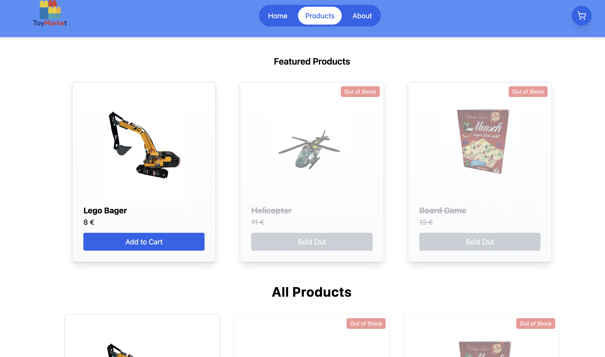

# ToyMarket 

ToyMarket is a full-stack e-commerce web application for selling new and used toys.  
The project was built as a portfolio and learning project, with a focus on real-world full-stack functionality such as product browsing, cart management, checkout flow, stock updates, and admin order handling.

## Live Demo


<p align="center">
  
</p>


- **Frontend:** https://toym.netlify.app/
- **Backend API:** [https://toymarket.onrender.com](https://toymarket.onrender.com)

## Features

- Browse all products
- Featured products slider
- Product detail page
- Add to cart
- Update cart quantity
- Remove items from cart
- Checkout form
- Order success page
- Admin orders panel
- Update order status
- Delete orders
- Stock control after purchase
- Responsive UI
- Sticky header
- Animated navigation and cart interactions

## Tech Stack

### Frontend
- React
- Vite
- React Router
- Tailwind CSS
- Framer Motion
- Swiper.js


### Backend
- Node.js
- Express.js
- MongoDB
- Mongoose
- CORS
- dotenv

### Deployment
- Netlify (Frontend)
- Render (Backend)
- MongoDB Atlas (Database)

## Project Structure

```bash
ToyMarket
│
├── backend
│   ├── src
│   │   ├── controllers
│   │   ├── models
│   │   ├── routes
│   │   └── index.js
│
├── frontend
│   ├── public
│   │   └── images
│   ├── src
│   │   ├── components
│   │   ├── context
│   │   ├── pages
│   │   └── App.jsx


-- Backend --
cd backend
npm install
npm run dev

--Frontend--
cd ../frontend
npm install
npm run dev

What I Learned

During this project I practiced:
	•	building a full-stack web application
	•	developing REST APIs
	•	using React Context for state management
	•	implementing cart and stock logic
	•	building admin functionality
	•	debugging real deployment issues
	•	deploying frontend and backend separately
	•	integrating MongoDB Atlas
	•	working with environment variables


Future Improvements

Possible improvements:
	•	user authentication
	•	admin login
	•	product management dashboard
	•	payment integration
	•	product search and filtering
	•	image upload
	•	improved error handling


Author

Ivan

GitHub
https://github.com/Ivan0812

